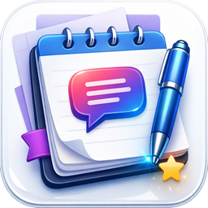

<p align="center">
  
</p>

<h1 align="center">PromptVault</h1>

<p align="center">
  A native macOS app for managing AI prompts — save, organize, search, and reuse.
  <br>
  Built with SwiftUI + CoreData.
</p>

<p align="center">
  
  
  
</p>

---

## Features

- **3-Column Layout** — Sidebar filters, prompt list, and detail editor in a native `NavigationSplitView`
- **Smart Filters** — View All prompts, Favorites, or Recent (last 7 days)
- **Categories** — Organize prompts with custom categories and SF Symbol icons
- **Search** — Real-time filtering by title and content
- **Auto-Save** — Debounced (500ms) automatic saving as you type
- **Clipboard Copy** — One-click copy with animated "Copied!" feedback
- **Keyboard Shortcuts** — `⌘N` New, `⌘⇧C` Copy, `⌘F` Find, `⌘⌫` Delete
- **Context Menus** — Copy, Duplicate, Move to Category, Favorite, Delete
- **Dark/Light Mode** — Automatic adaptation via system colors and SF Symbols
- **CoreData Persistence** — All data stored locally with a programmatic data model

## Architecture

```
prompt/
├── Models/                  # CoreData NSManagedObject subclasses
│   ├── PromptEntity.swift
│   └── CategoryEntity.swift
├── Persistence/             # CoreData stack (programmatic model)
│   └── PersistenceController.swift
├── ViewModels/              # ObservableObject view models
│   ├── PromptListViewModel.swift
│   └── CategoryViewModel.swift
├── Views/                   # SwiftUI views
│   ├── SidebarView.swift
│   ├── PromptListView.swift
│   ├── PromptDetailView.swift
│   ├── PromptRowView.swift
│   └── AddCategorySheet.swift
├── Helpers/                 # Utilities
│   ├── ClipboardManager.swift
│   └── DateFormatter+Extensions.swift
├── ContentView.swift        # Main 3-column layout
└── promptApp.swift          # App entry point + keyboard commands
```

**Pattern**: MVVM with CoreData
**Data Model**: Defined programmatically (no `.xcdatamodeld` file) — the model is built in code using `NSManagedObjectModel`, `NSEntityDescription`, and `NSAttributeDescription`.

## Requirements

- macOS 14.0+
- Xcode 15.0+
- Swift 5.9+

## Getting Started

1. Clone the repository:
   ```bash
   git clone https://github.com/unmediacode/PromptVault.git
   ```
2. Open `prompt.xcodeproj` in Xcode
3. Build and run (`⌘R`)

No dependencies — everything uses Apple frameworks (SwiftUI, CoreData, Combine, AppKit).

## Contributing

Contributions are welcome! Here are some ideas:

- **Export/Import** — JSON or Markdown export of prompts
- **Tags** — Multi-tag support beyond single categories
- **Templates** — Prompt templates with variable placeholders
- **iCloud Sync** — Sync prompts across devices via CloudKit
- **Markdown Preview** — Render prompt content as Markdown
- **Prompt Variables** — `{{variable}}` placeholders with fill-in UI

To contribute:

1. Fork the repository
2. Create a feature branch (`git checkout -b feature/amazing-feature`)
3. Commit your changes
4. Push to the branch (`git push origin feature/amazing-feature`)
5. Open a Pull Request

## License

This project is licensed under the MIT License — see the [LICENSE](LICENSE) file for details.
